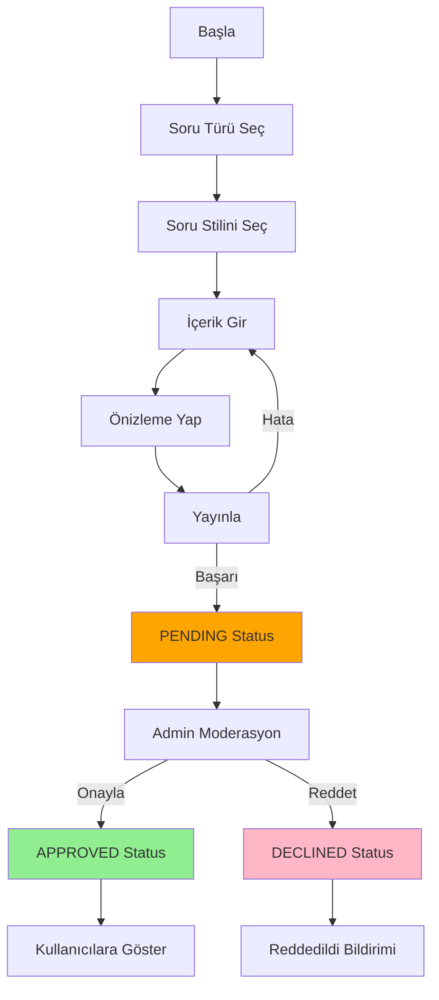

# Soru Oluşturma ve Yayınlama Akışı (Question Creation & Publishing Flow)

Bu doküman, tasarımcıyla iletişime geçilmeden önce uygulanması gereken soru oluşturma ve yayınlama
sürecinin detaylı bir haritasını içerir.

---

## 1. Genel Akış Özeti (Overall Flow Summary)

```
[Başla] 
  ↓
[Soru Türü Seçimi] (Question Type Selection)
  ├─ TWO_CHOICE (YES/NO, UP/DOWN, GOOD/BAD)
  ├─ THREE_CHOICE (Low/Med/High, Agree/Neutral/Disagree)
  ├─ MULTI_CHOICE
  ├─ SCALE
  └─ OPEN_ENDED
  ↓
[Soru Stili/Alt Kategorisi Seçimi] (Question Style / Sub-Category Selection)
  ├─ Seçili türe göre alt kategoriler gösterilir
  └─ Her tür için varsayılan seçenekler/constraints ayarlanır
  ↓
[Soru İçeriği Girişi] (Question Content Entry)
  ├─ Başlık (Title) - Zorunlu
  ├─ Açıklama (Description) - Opsiyonel
  └─ İçerik Doğrulama
  ↓
[Soru Önizlemesi] (Question Preview)
  ├─ Seçili tür/stilde soru nasıl görüneceğini göster
  └─ Kullanıcı geri dönüş seçeneği var
  ↓
[Soru Yayınlama] (Question Publishing)
  ├─ Backend'e gönder (Firestore)
  ├─ Yayınlama Durumu: "PENDING" (Moderation için hazır)
  └─ Başarılı/Hata Bildirimi
  ↓
[Admin Moderasyon Ekranı] (Admin Moderation Screen)
  ├─ Bekleme Durumundaki Soruları Listele
  ├─ Onay (Approve) / Reddet (Decline)
  └─ Onaylanan Sorular: "APPROVED" → Kullanıcılara gösterilir
```

---

## 2. Detaylı Aşamalar (Detailed Stages)

### 2.1 Soru Türü Seçimi Ekranı (Question Type Selection Screen)

**Dosya Adı:** `QuestionTypeSelectionScreenSetup.kt` (Yeni)

**Amaç:** Kullanıcıya 5 ana soru türünden birini seçmeleri için seçenek sunar.

**UI Elemanları:**

- **Header:** "Soru Türünü Seçin" (Select Question Type)
- **Türler (Cards/Grid Layout):**
    1. **TWO_CHOICE**
        - Icon: Tick/X veya Yes/No
        - Başlık: "İki Seçenek" (Two Options)
        - Alt Metin: "Evet/Hayır, Yukarı/Aşağı, İyi/Kötü"
    2. **THREE_CHOICE**
        - Icon: 3-nokta ölçeği
        - Başlık: "Üç Seçenek" (Three Options)
        - Alt Metin: "Düşük/Orta/Yüksek, Katılıyorum/Tarafsız/Katılmıyorum"
    3. **MULTI_CHOICE**
        - Icon: Checkbox
        - Başlık: "Çoklu Seçim" (Multiple Choices)
        - Alt Metin: "Birden fazla seçenek seçilebilir"
    4. **SCALE**
        - Icon: Slider/Ölçek
        - Başlık: "Ölçek" (Scale/Rating)
        - Alt Metin: "0-100 arası değer"
    5. **OPEN_ENDED**
        - Icon: Metin kutusu
        - Başlık: "Açık Uçlu" (Open Ended)
        - Alt Metin: "Serbest yazı"

**Durum Yönetimi:**

```kotlin
data class QuestionTypeSelectionUiState(
    val selectedType: QuestionCategories? = null,
    val isLoading: Boolean = false,
)

sealed class QuestionTypeSelectionEvent : BaseEvent() {
    data class OnTypeSelected(val type: QuestionCategories) : QuestionTypeSelectionEvent()
    data object OnCancel : QuestionTypeSelectionEvent()
}
```

**Navigation:**

- OnTypeSelected → `QuestionStyleSelectionScreen` (Soru Stilini Seç)
- OnCancel → Geri (Önceki Ekran)

---

### 2.2 Soru Stili / Alt Kategorisi Seçimi (Question Style/Sub-Category Selection)

**Dosya Adı:** `QuestionStyleSelectionScreenSetup.kt` (Yeni)

**Amaç:** Seçilen türe göre alt kategorileri (stilleri) gösterir.

**Dinamik Ekran Içeriği:**

#### TWO_CHOICE Türü Seçilmişse:

```kotlin
TwoChoiceSubCategories Seçenekleri :
├─ YES_NO
│  ├─ Adı: "Evet / Hayır"
│  ├─ Preview: [Yes Button] [No Button]
│  └─ Options: QueOption(id = "YES", ...), QueOption(id = "NO", ...)
├─ UP_DOWN
│  ├─ Adı: "Yukarı / Aşağı"
│  ├─ Preview: [Up Button] [Down Button]
│  └─ Options: QueOption(id = "UP", ...), QueOption(id = "DOWN", ...)
└─ GOOD_BAD
├─ Adı: "İyi / Kötü"
├─ Preview: [Good Button] [Bad Button]
└─ Options: QueOption(id = "GOOD", ...), QueOption(id = "BAD", ...)
```

#### THREE_CHOICE Türü Seçilmişse:

```kotlin
ThreeChoiceSubCategories Seçenekleri :
├─ LOW_MED_HIGH
│  ├─ Adı: "Düşük / Orta / Yüksek"
│  ├─ Preview: [Low] [Med] [High]
│  └─ Options: QueOption(id = "LOW", ...), QueOption(id = "MEDIUM", ...), QueOption(id = "HIGH", ...)
└─ AGREE_NEUTRAL_DISAGREE
├─ Adı: "Katılıyorum / Tarafsız / Katılmıyorum"
├─ Preview: [Agree] [Neutral] [Disagree]
└─ Options: QueOption(id = "AGREE", ...), QueOption(id = "NEUTRAL", ...), QueOption(id = "DISAGREE", ...)
```

**Durum Yönetimi:**

```kotlin
data class QuestionStyleSelectionUiState(
    val selectedType: QuestionCategories,
    val selectedStyle: String? = null, // subCategoryKey
    val isLoading: Boolean = false,
)

sealed class QuestionStyleSelectionEvent : BaseEvent() {
    data class OnStyleSelected(val styleKey: String) : QuestionStyleSelectionEvent()
    data object OnBack : QuestionStyleSelectionEvent()
    data object OnCancel : QuestionStyleSelectionEvent()
}
```

**Navigation:**

- OnStyleSelected → `QuestionContentInputScreen` (İçerik Gir)
- OnBack → `QuestionTypeSelectionScreen` (Geri)
- OnCancel → Ana Sayfa

---

### 2.3 Soru İçeriği Girişi (Question Content Entry)

**Dosya Adı:** Mevcut `QuestionCreateQuestionScreenSetup.kt` (Genişletilecek)

**Amaç:** Kullanıcı soru başlığı ve açıklamasını girer, seçili tür/stil gösterilir.

**UI Elemanları:**

- **Header:** "Soru Oluştur" (Create Question)
- **Seçilen Tür & Stil Gösterimi:**
  ```
  Tür: [Başlık] | Stil: [Başlık]
  ```
- **Input Alanları:**
    1. **Başlık (Title) - Zorunlu**
        - TextField
        - Karakter Sınırı: 1-200 karakter
        - Hata: "Başlık en az 1 karakter içermeli"
    2. **Açıklama (Description) - Opsiyonel**
        - TextField (Multiline)
        - Karakter Sınırı: 0-2000 karakter
        - Dinamik Karakter Sayacı

- **Alt Bilgi:**
  ```
  Seçili Seçenekler:
  ├─ [Option 1] | [Option 2] | [Option 3] (geçerli ise)
  └─ veya Dinamik olarak gösterilir
  ```

- **Butonlar:**
    - "Önizleme Yap" (Preview)
    - "İptal" (Cancel)

**Durum Yönetimi (Mevcut Genişletilecek):**

```kotlin
data class QuestionCreateQuestionScreenUiState(
    val isLoading: Boolean = false,
    val errorText: String = "",
    val titleText: String = "",
    val descriptionText: String = "",
    val toolbarTitleText: String = "Create Question",
    val isSubmitEnabled: Boolean = false,
    val isSubmitted: Boolean = false,
    val taxonomy: QuestionTaxonomyRef = ...,
// Yeni alanlar:
val selectedTypeLabel: String = "", // Örn: "İki Seçenek"
val selectedStyleLabel: String = "", // Örn: "Evet / Hayır"
val currentOptions: ImmutableList<QueOption> = persistentListOf(), // Dinamik seçenekler
)

// Mevcut event'lere ilave:
sealed class QuestionCreateQuestionEvent : BaseEvent() {
    // ...
    data class OnDescriptionChange(val text: String) : QuestionCreateQuestionEvent()
    data object OnPreview : QuestionCreateQuestionEvent()
}
```

**Doğrulama:**

- Başlık boş ise "Oluştur" butonu disabled

**Navigation:**

- OnPreview → `QuestionPreviewScreen` (Önizleme)
- Cancel → Ana Sayfa veya Geri

---

### 2.4 Soru Önizlemesi (Question Preview Screen)

**Dosya Adı:** `QuestionPreviewScreenSetup.kt` (Yeni)

**Amaç:** Oluşturulan sorunun seçili tür/stilde nasıl görüneceğini gösterir.

**UI Elemanları:**

- **Header:** "Soru Önizlemesi" (Question Preview)
- **Soru Kartı:**
  ```
  ┌─────────────────────────┐
  │ Başlık: [Soru Başlığı]  │
  │ Açıklama: [...]         │
  │                         │
  │ Seçenekler:             │
  │ ├─ [Option 1] Button    │
  │ ├─ [Option 2] Button    │
  │ └─ [Option 3] Button    │
  │                         │
  │ [Düzenle] [Yayınla]     │
  └─────────────────────────┘
  ```

- **Butonlar:**
    - "Düzenle" (Edit) → Geri İçerik Ekranına
    - "Yayınla" (Publish) → Yayınlama İşlemi

**Durum Yönetimi:**

```kotlin
data class QuestionPreviewUiState(
    val question: QuestionViewUiState,
    val isLoading: Boolean = false,
)

sealed class QuestionPreviewEvent : BaseEvent() {
    data object OnEdit : QuestionPreviewEvent()
    data object OnPublish : QuestionPreviewEvent()
    data object OnCancel : QuestionPreviewEvent()
}
```

**Navigation:**

- OnEdit → `QuestionContentInputScreen` (Geri)
- OnPublish → Yayınlama + `AdminApproveQuestion` veya Başarı Bildirimi
- OnCancel → Ana Sayfa

---

### 2.5 Soru Yayınlama (Question Publishing)

**Dosya Adı:** Mevcut `FirebaseQuestionOperationRepository` (Genişletilecek)

**Backend Işlemi:**

1. `QuestionPreviewScreen` üzerindeki `Yayınla` butonu tıklanır
2. ViewModel `repository.createQuestion(body)` çağrısı yapar
3. `QuestionOperationResponseBody` gönderilir:
   ```kotlin
   QuestionOperationResponseBody(
       questionId = UUID,
       questionTitle = "Başlık",
       questionType = QuestionType.SINGLE_CHOICE,
       taxonomy = QuestionTaxonomyRef(...),
       options = [QueOption(...), ...],
       constraints = QueConstraints(...),
       metadata = {...},
       version = 1,
       createdAt = Timestamp.now(),
   )
   ```

4. **Firestore Collection:** `"createQuestion"`
    - Document ID: `questionId` (UUID)
    - Fields:
      ```json
      {
        "questionId": "uuid-123",
        "questionTitle": "...",
        "questionType": "SINGLE_CHOICE",
        "taxonomy": {...},
        "options": [{id, text, order}, ...],
        "constraints": {...},
        "metadata": {...},
        "version": 1,
        "createdAt": Timestamp,
        "status": "PENDING", // NEWLY ADDED FOR MODERATION
        "userId": "creator-uid",
        "approvedAt": null,
        "declinedAt": null,
        "approvedBy": null
      }
      ```

5. **Durum Döndür:**
    - Başarı: Snackbar "Soru başarıyla yayınlandı!" → AdminApproveQuestion ekranına yönlendir
    - Hata: Snackbar "Yayınlama başarısız" + Hata Mesajı

**İyileştirmeler (Backend):**

- `status` alanı add et ("PENDING", "APPROVED", "DECLINED")
- `userId` alanı add et (Soru yaratıcısı)
- `approvedAt`, `declinedAt`, `approvedBy` alanları add et

---

### 2.6 Admin Moderasyon Ekranı (Admin Moderation Screen)

**Dosya Adı:** Mevcut `AdminApproveQuestionScreenSetup.kt` (Zaten yapılmış)

**Amaç:** Admin, PENDING durumundaki soruları inceler ve onaylar/reddeder.

**UI Elemanları:**

- **Sekmeler (Tabs):**
    - "Tümü" (All) - Tüm sorular
    - "Beklemede" (Pending) - Yayınlanmış ama onay bekleme
    - "Onaylı" (Approved) - Onaylanan sorular
    - "Reddedildi" (Declined) - Reddedilen sorular

- **Liste Görünümü:**
  ```
  ├─ Soru 1
  │  ├─ Başlık
  │  ├─ Yaratıcı (User Name)
  │  ├─ Tarih
  │  ├─ Seçenekler
  │  └─ [Onayla] [Reddet] (sadece PENDING tab'ında)
  └─ Soru 2
  ```

- **Toplu İşlem Butonları:**
    - "Tümünü Onayla" (Approve All)
    - "Tümünü Reddet" (Decline All)

**Repository Fonksiyonları (Mevcut Genişletilecek):**

```kotlin
interface FirebaseQuestionOperationRepository {
    fun getQuestionList(): Flow<List<QuestionOperationResponseBody>>
    fun getQuestionsByStatus(status: String): Flow<List<QuestionOperationResponseBody>>
    fun createQuestion(body: QuestionOperationResponseBody): Flow<Unit>

    // Yeni Fonksiyonlar:
    fun approveQuestion(questionId: String, adminId: String): Flow<Unit>
    fun declineQuestion(questionId: String, adminId: String, reason: String?): Flow<Unit>
    fun approveAllPendingQuestions(adminId: String): Flow<Unit>
}
```

**Firestore Güncelleme:**

```json
{
  "status": "APPROVED",
  "approvedAt": Timestamp.now(),
  "approvedBy": "admin-uid"
}
```

---

## 3. Durum Akışı (State Flow)



---

## 4. Teknik Gereksinimler

### 4.1 Model Genişlemeleri

**Firestore'da Eklenecek Alanlar:**

```kotlin
data class QuestionOperationResponseBody(
    // Mevcut alanlar...

    // Yeni Alanlar (Moderation & Tracking):
    val status: String = "PENDING", // PENDING, APPROVED, DECLINED
    val creatorId: String = "",
    val approvedAt: Long? = null,
    val declinedAt: Long? = null,
    val approvedBy: String? = null,
    val declineReason: String? = null,
)
```

### 4.2 Repository Sözleşmesi

```kotlin
interface FirebaseQuestionOperationRepository {
    // Mevcut
    fun getQuestionList(): Flow<List<QuestionOperationResponseBody>>
    fun createQuestion(body: QuestionOperationResponseBody): Flow<Unit>

    // Yeni
    fun getQuestionsByStatus(status: String): Flow<List<QuestionOperationResponseBody>>
    fun approveQuestion(questionId: String, adminId: String): Flow<Unit>
    fun declineQuestion(questionId: String, adminId: String, reason: String = ""): Flow<Unit>
    fun approveAllPendingQuestions(adminId: String): Flow<Unit>
}
```

### 4.3 ViewModel Orchestration

**QuestionTypeSelectionVm → QuestionStyleSelectionVm → QuestionCreateQuestionVm → QuestionPreviewVm
**

- Her ViewModel'in önceki seçimleri saklayarak sonrakine geçmesi
- Geri navigasyonunda state korunması

### 4.4 Language Keys (Lokalizasyon)

```kotlin
LanguageKey.{ questionTypeSelectionTitle,
              questionTypeSelectionDescription,
              twoChoiceLabel,
              threeChoiceLabel,
              multiChoiceLabel,
              scaleLabel,
              openEndedLabel,

              questionStyleSelectionTitle,
              yesNoLabel,
              upDownLabel,
              goodBadLabel,
              lowMedHighLabel,
              agreeNeutralDisagreeLabel,

              questionContentInputTitle,
              questionTitlePlaceholder,
              questionDescriptionPlaceholder,
              questionPreviewButton,

              questionPreviewTitle,
              editButton,
              publishButton,

              questionPublishingSuccessMessage,
              questionPublishingErrorMessage,

              adminModerationTitle,
              allTab,
              pendingTab,
              approvedTab,
              declinedTab,
              approveAllButton,
              declineAllButton,
}
```

---

## 5. İçerik Tasarımcısından Beklenen Şeyler

### 5.1 UI/UX Tasarımlar

- [ ] Soru Türü Seçimi (Card/Grid Layout)
- [ ] Soru Stili Seçimi (Preview'larla)
- [ ] İçerik Girişi (Form Layout)
- [ ] Soru Önizlemesi (Card Layout)
- [ ] Admin Moderasyon (Tabbed List)

### 5.2 İkonlar/Assets

- [ ] Soru Türleri için İkonlar (2choice, 3choice, multi, scale, open)
- [ ] Moderasyon Ekranı İkonları (Onayla, Reddet, vb.)

### 5.3 Renk Şeması & Tema

- [ ] PENDING Status Rengi (Örn: Orange)
- [ ] APPROVED Status Rengi (Örn: Green)
- [ ] DECLINED Status Rengi (Örn: Red)

### 5.4 Animasyonlar

- [ ] Seçim Animasyonları (Button/Card State)
- [ ] Geçiş Animasyonları (Screen transitions)
- [ ] Loading State Animasyonu

---

## 6. Uygulama Adımları (Implementation Order)

1. **Aşama 1:** Model & Repository genişlemeleri
2. **Aşama 2:** `QuestionTypeSelectionScreen` + ViewModel
3. **Aşama 3:** `QuestionStyleSelectionScreen` + ViewModel
4. **Aşama 4:** `QuestionCreateQuestionScreen` genişletme
5. **Aşama 5:** `QuestionPreviewScreen` + ViewModel
6. **Aşama 6:** `AdminApproveQuestionScreen` genişletme (Approve/Decline butonları)
7. **Aşama 7:** Integration & Testing

---

## 7. Test Senaryoları

### 7.1 Pozitif Senaryolar

- [ ] Tüm türler için soru oluştur ve yayınla
- [ ] Admin sorulu onayla
- [ ] Onaylanan soru liste'de görün

### 7.2 Negatif Senaryolar

- [ ] Boş başlık ile yayınlamayı dene (başarısız olmalı)
- [ ] Admin sorulu reddet
- [ ] Reddedilen soru için notifikasyon al

### 7.3 Edge Cases

- [ ] Network hatası sırasında yayınlama
- [ ] Yayınlama sırasında arka planı kapat (state kurtarma)
- [ ] Admin yazarı geri al (undo)

---

## Notlar

- **Moderation Status:** Tüm yeni sorular başlangıçta "PENDING" statusu ile kaydedilir
- **User Tracking:** Her sorunun yaratıcı ID'si kaydedilir
- **Admin Audit:** Onay/Red işlemleri admin ID ile kaydedilir
- **Soft Delete:** Silme işleminde status "DELETED" yapılabilir (hard delete değil)

---

**Son Güncelleme:** 2025-10-15
**Durum:** Tasarımcıyla Görüşme Öncesi - Hazır
