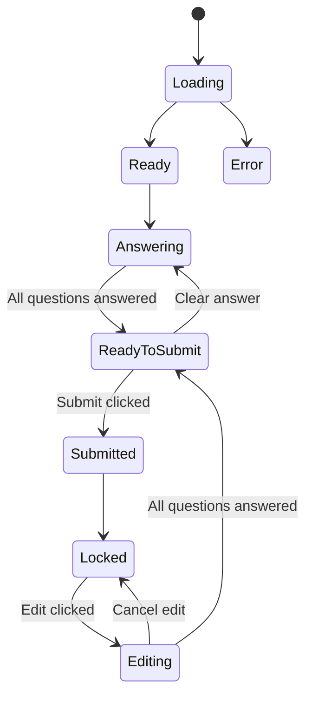

# Question Form Screen Architecture

## 📋 Overview

Bu ekran, kullanıcıların bir form içindeki birden fazla soruyu görüntüleyip cevaplayabildiği bir
katalog ekranıdır.

## 🎯 Features

### 1. **Form Görüntüleme**

- Title ve description alanları
- Sorular katalogu (birden fazla soru)
- Her soru için answer seçim alanları

### 2. **Answer Flow**

- Kullanıcı tüm soruları cevaplar
- Progress bar gösterir (kaç soru cevaplanmış)
- Tüm sorular cevaplanınca "Submit" butonu aktif olur

### 3. **Submit & Lock**

- Submit edilince:
    - Sorular kilitlenir (read-only)
    - Verdiği cevapları görebilir ama değiştiremez
    - Comments section açılır

### 4. **Edit Mode**

- "Edit Form" butonuyla tekrar düzenleme moduna geçilebilir
- Sorular tekrar aktif hale gelir
- Cevapları değiştirebilir

### 5. **Comments Section**

- Form submit edildikten sonra görünür
- Kullanıcılar yorum ekleyebilir
- Yorumlar description'ın altında gösterilir

## 📁 File Structure

```
questionForm/
├── QuestionFormScreenUiState.kt    # UI State & Events
├── QuestionFormViewModel.kt        # Business Logic
├── QuestionFormScreen.kt           # UI Components
└── README.md                       # This file
```

## 🏗️ Architecture

### Data Flow

```
User Action → Event → ViewModel → State Update → UI Re-render
```

### State Management

#### QuestionFormScreenUiState

```kotlin
data class QuestionFormScreenUiState(
    val formId: String,
    val title: String,
    val description: String,
    val questions: ImmutableList<QuestionItemState>,
    val isSubmitted: Boolean,
    val isLocked: Boolean,
    val comments: ImmutableList<FormComment>,
    val canSubmit: Boolean,
    // ...
)
```

#### QuestionItemState

Her bir soru için state:

```kotlin
data class QuestionItemState(
    val questionId: String,
    val questionTitle: String,
    val questionData: QuestionOperationResponseBody,
    val selectedOptionId: String?,
    val isAnswered: Boolean,
    val isEnabled: Boolean, // Locked durumunda false
)
```

#### FormComment

Yorumlar için:

```kotlin
data class FormComment(
    val commentId: String,
    val userId: String,
    val userName: String,
    val commentText: String,
    val createdAt: Long,
)
```

### Events

#### QuestionFormEvent

```kotlin
sealed class QuestionFormEvent {
    // Form actions
    object OnSubmitForm
    object OnEditForm
    object OnCancelEdit

    // Question interactions
    data class OnQuestionAnswered(questionId: String, optionId: String)
    data class OnClearAnswer(questionId: String)

    // Comment actions
    data class OnCommentTextChanged(text: String)
    object OnAddComment
    data class OnDeleteComment(commentId: String)
}
```

#### QuestionFormUiEvent (One-shot events)

```kotlin
sealed class QuestionFormUiEvent {
    object OnSubmitSuccess
    data class OnSubmitError(message: String)
    object OnFormLocked
    object OnFormUnlocked
}
```

## 🎨 UI Components

### 1. FormTitleSection

- Form başlığı ve açıklaması
- Submit durumu badge'i

### 2. ProgressSection

- Kaç sorunun cevaplanmış olduğunu gösterir
- Progress bar

### 3. QuestionItemCard

- Her bir soru için card
- Soru başlığı
- Cevap seçenekleri (QuestionView component'i kullanılacak)
- Cevaplandı badge'i

### 4. FormActionButtons

- Submit button (tüm sorular cevaplandığında)
- Edit button (submit sonrası)
- Cancel edit button

### 5. CommentsSection

- Yorum listesi
- Yorum ekleme input'u
- Submit sonrası görünür

## 🔄 State Transitions



## 🔌 Integration Points

### Repository Layer (TODO)

```kotlin
interface QuestionFormRepository {
    suspend fun loadForm(formId: String): Result<FormData>
    suspend fun submitAnswers(formId: String, answers: List<Answer>): Result<Unit>
    suspend fun addComment(formId: String, comment: String): Result<Comment>
    suspend fun deleteComment(commentId: String): Result<Unit>
}
```

### Navigation

```kotlin
// Usage
QuestionFormScreenSetup(
    formId = "form_123",
    onNavigateBack = { navController.popBackStack() }
)
```

## 📝 Usage Example

```kotlin
@Composable
fun MyNavigation() {
    NavHost(navController, startDestination = "home") {
        composable("questionForm/{formId}") { backStackEntry ->
            val formId = backStackEntry.arguments?.getString("formId") ?: ""
            QuestionFormScreenSetup(
                formId = formId,
                onNavigateBack = { navController.popBackStack() }
            )
        }
    }
}
```

## 🎭 Preview States

### 1. Normal State (Not Submitted)

```kotlin
previewQuestionFormScreenUiState(
    isSubmitted = false,
    questionsCount = 3
)
```

### 2. Submitted State

```kotlin
previewQuestionFormScreenUiState(
    isSubmitted = true,
    questionsCount = 3
)
```

### 3. Loading State

```kotlin
previewLoadingState()
```

### 4. Error State

```kotlin
previewErrorState()
```

### 5. Empty Form

```kotlin
previewEmptyFormState()
```

## 🔍 Validation Rules

1. **Submit Validation:**
    - Title boş olamaz
    - Tüm sorular cevaplanmış olmalı

2. **Comment Validation:**
    - Yorum boş olamaz

## 🎯 Next Steps

### UI Integration

- [ ] Mevcut `QuestionViewUiState` component'ini `QuestionItemCard` içine entegre et
- [ ] Question options rendering (YES/NO, Multiple Choice, etc.)
- [ ] Custom error dialogs

### Backend Integration

- [ ] Repository implementation
- [ ] API calls
- [ ] Error handling
- [ ] Loading states

### Additional Features

- [ ] Draft save (otomatik kaydetme)
- [ ] Answer validation rules
- [ ] Required/Optional questions
- [ ] Question dependencies (conditional questions)
- [ ] Rich text support for description
- [ ] Image attachments for comments
- [ ] Real-time updates (Socket/Firebase)

## 📚 Related Files

- `QuestionViewUiState.kt` - Tek soru için state management
- `QuestionOperationResponseBody.kt` - Backend model
- `QueAnswer.kt` - Answer model
- `QueOption.kt` - Option model

## 🐛 Known Issues / Limitations

1. Question rendering şu an placeholder (gerçek QuestionView entegre edilecek)
2. Repository layer mock
3. User authentication entegrasyonu yok
4. Offline support yok

## 💡 Tips

1. **Immutable Collections:** `ImmutableList` kullanarak recomposition optimize edilmiş
2. **Single Responsibility:** Her component kendi işini yapar
3. **Preview Support:** Her durum için preview var
4. **Type Safety:** Sealed class'lar ile type-safe event handling

---

**Created:** 17.11.2025  
**Author:** Erdi Özbek  
**Version:** 1.0.0

